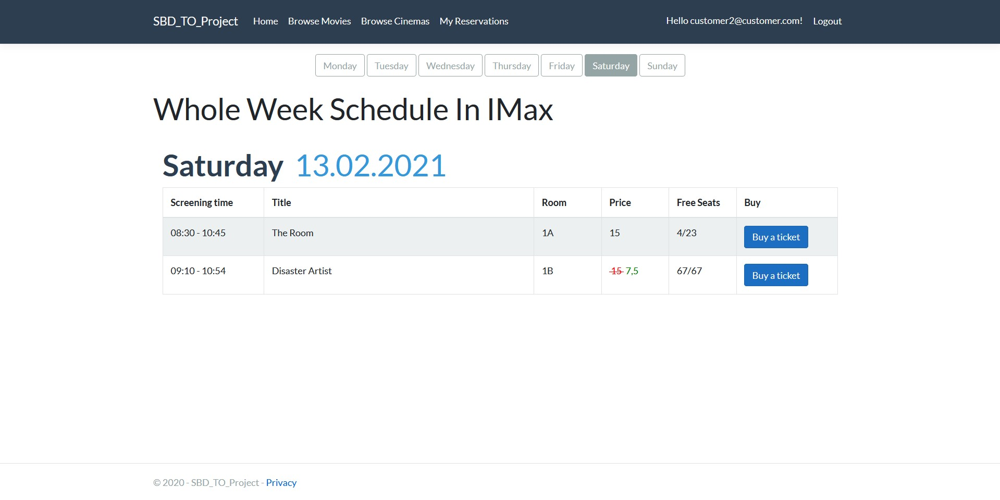
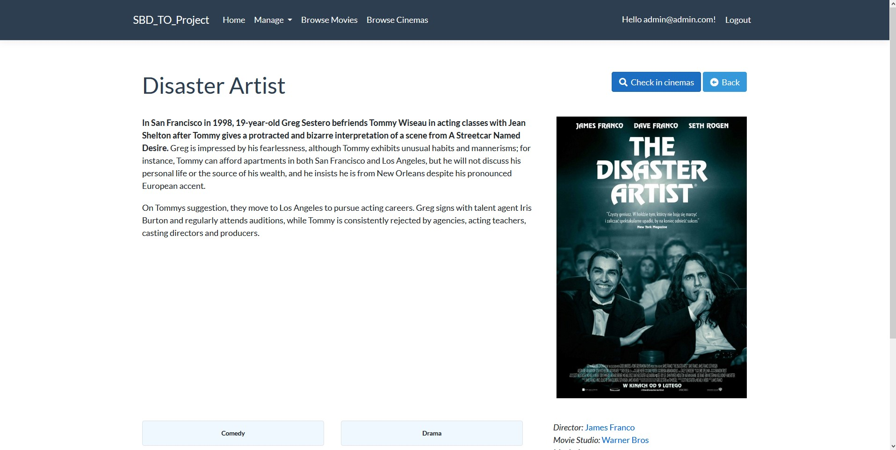
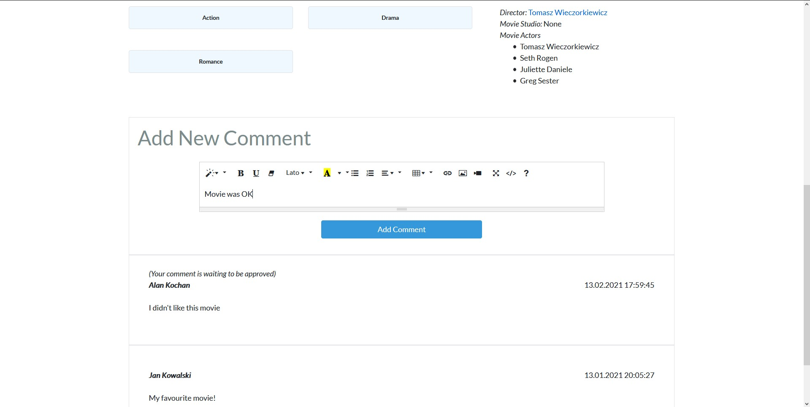
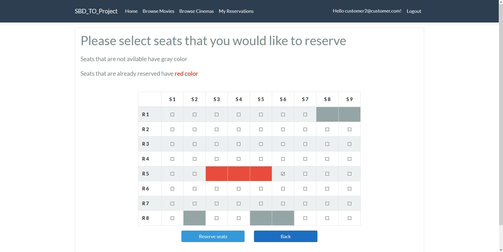
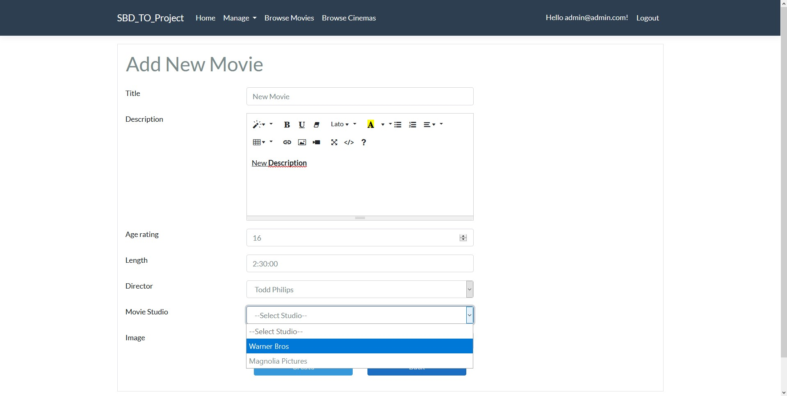

# CinemaManagementApp
This is a cinema management web application. It allows users to use it differently according to their role. 
Cinema employees are able to manage movies, schedules, reservations and customers are able to browse movies and cinemas, comment movies and place  reservations.
## Table of contents
* [Introduction](#introduction)
* [Features](#features)
  * [Guest account features](#as-guest-user)
  * [Client account features](#as-logged-user)
  * [Employee account features](#as-cinema-employee)
  * [Manager account features](#as-cinema-manager)
  * [Admin account features](#as-admin-user)
* [Technologies](#technologies)
* [Application examplery useged](#application-examplery-useged)
## Introduction
This project was created as final project for The Object-Oriented technology and Database Systems classes.
## Features
### As guest user
#### First account created in application has assigned admin role, all other accounts have default client role
* Register, login
* Browse movies, cinemas, shchedules
* Display movie details
### As logged user
* Comment movie
* Place a reservation
* Browse reservation and complaints
* Create a complaint
### As cinema employee
#### Employees can only access data associated with a cinema that employee is assigned to
* Approve, delete comments
* Change client's payment status
* Resolve client's complaint
### As cinema manager
#### Managers can only access data associated with a cinema that manager is assigned to. Created employee accounts are automaticly assigned to currenty logged manager.
* Preform CRUD operations on movies, genres, movie studios, actors, directors, schedules, screening rooms and cinemas
* Create, modify, delete and assign employee accounts to given cinema
### As admin user
* Perform CRUD operations on any entity
* Create, modify, delete and assign employee accounts to given manager account and cinema
* Create, modify, delete and assign manager accounts to given cinema
## Technologies
* ASP .NET Core 3.1.10
* Entity Framework 3.1.10
* Bootstrap
* JavaScript
### Additional Libraries
* SweetAlert2
* Summernote
* Fontawesome
### Database
Application uses MS SQL Server 2019
## Application exemplary usage
### Movies browse page

### Schedules browse page

### Movie details page

### Movie details comment section

### Seat reservation page

### Movie adding page

